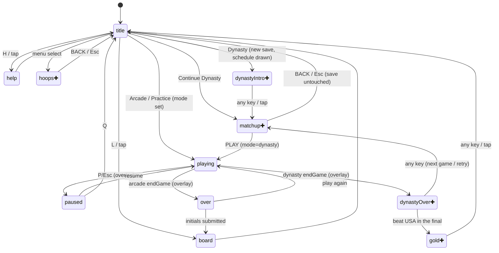
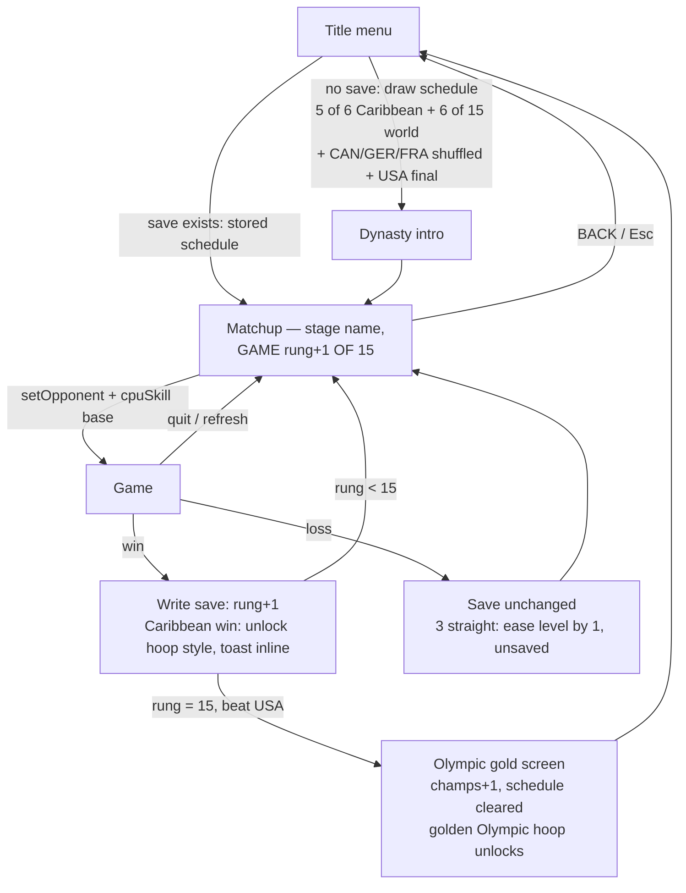

# JA JAM FIBA Update - Plan

## Goal Capsule

- **Objective:** Ship the FIBA update to JA JAM: **Dynasty Mode** (a 15-game campaign per dynasty — Caribbean Qualifiers → FIBA World Cup → Olympics, with a freshly drawn schedule each dynasty and Team USA always the final), arcade mode rotating through the full 25-team FIBA opponent roster, a shooting-practice mode, cosmetic hoop designs unlocked by dynasty wins, expressive big-head faces, and real-roster name pools for every team (the fixed "VJ" retires). Everything stays inside the single zero-dependency `index.html`.
- **Authority:** This plan's Product Contract and KTDs govern; repo conventions in `CLAUDE.md` and `docs/solutions/` override implementation details where they conflict; the user overrides everything.
- **Execution profile:** Sequential units in dependency order, one commit per unit (repo convention: small feature commits to `main`, which auto-deploys via GitHub Pages). Because every commit deploys, no menu entry ships before its mode exists (see Sequencing).
- **Stop conditions:** Stop and surface if (a) a change would alter arcade match rules or leaderboard semantics, (b) the Supabase schema would need changes, or (c) hoop/physics geometry constants would need to move — all three are explicitly out of scope.
- **Tail:** After all units pass the Verification Contract, run the final real-iOS device pass (U9) before considering the work shippable.

---

## Product Contract

### Summary

JA JAM grows from a single endless 1v1 loop into a small game with modes: an arcade run against a rotating cast of real FIBA national teams; **Dynasty Mode**, a 15-game campaign where Jamaica fights through the Caribbean Qualifiers, a FIBA World Cup draw, and finally the Olympics — beating Team USA for gold; and a free shootaround practice mode. Each dynasty draws a fresh schedule, so no two campaigns play the same. The title screen becomes a real menu. Cosmetic hoop designs reward dynasty progress. Sprites get expressive Basketball Stars-style faces, and every team draws player names from real FIBA roster pools.

### Problem Frame

The game currently has one loop: beat the same Bahamas CPU repeatedly as it levels up. There is no destination (nothing to win), no opponent variety, no low-stakes space to learn shooting, and no reward loop. The Basket Bros reference screenshots show what's missing: a campaign with named opponents and matchup screens, a practice mode with PERCENT/STREAK feedback, and character/cosmetic variety.

### Requirements

**Modes**

- R1. Dynasty Mode: a 15-game campaign in three stages, with the schedule **drawn fresh at the start of each dynasty** and stored in the save:
  - **Stage 1 — Caribbean Qualifiers (games 1-5):** five games drawn from the six-team Caribbean pool (Guyana, USVI, Cuba, Bahamas, Dominican Republic, Puerto Rico), shuffled order — one Caribbean nation sits out each dynasty.
  - **Stage 2 — FIBA World Cup (games 6-11):** six games drawn from the fifteen-team world pool (Philippines, Mexico, China, South Sudan, Finland, Turkey, Brazil, Greece, Slovenia, Latvia, Lithuania, Argentina, Spain, Australia, Serbia), shuffled order.
  - **Stage 3 — Olympics (games 12-15):** always the top four — Canada, Germany, and France in random order for games 12-14, and **USA is always game 15, the gold-medal final**.
  A dynasty-intro dialog screen, a pre-game matchup screen per game ("GAME N OF 15" with the stage name), and an Olympic-gold celebration on beating USA.
- R2. Dynasty progress (including the drawn schedule) persists in `localStorage`: mid-dynasty resume from the title menu, retry the same game after a loss, and a new-dynasty option after winning gold that redraws the schedule and resets the rung but keeps cosmetic unlocks.
- R3. Shooting practice: no defender, no clock, no CPU; HUD shows shooting PERCENT (makes/attempts) and STREAK instead of score/clock; exit via pause → quit.
- R4. Arcade match behavior is unchanged — 2:00 games, run-based session scoring, leaderboard submission on first loss, win-based leveling CPU — except the opponent's identity, which now rotates per R11.
- R11. Arcade opponent rotation: each arcade game draws a random team from the full 25-team FIBA roster (all R7 teams), never repeating the immediately previous opponent. Difficulty continues to come from the existing win-based `cpuLevel` ladder, independent of which team is drawn.

**Presentation**

- R5. The title screen becomes a navigable menu — Arcade, Dynasty (or Continue Dynasty), Practice, Hoop Designs, plus the existing Help and Leaderboard entries — operable by keyboard (Up/Down + Enter; H/L keep their legacy letter shortcuts, no new letter shortcuts), mouse/tap, and the touch overlay.
- R6. Big-head sprites get expressive faces (eye/brow/mouth variety per player, a fire-mode expression), applied to every team through one generation path.
- R7. Twenty-five opponent teams — Caribbean pool: Guyana, USVI, Cuba, Bahamas, Dominican Republic, Puerto Rico; world pool: Philippines, Mexico, China, South Sudan, Finland, Turkey, Brazil, Greece, Slovenia, Latvia, Lithuania, Argentina, Spain, Australia, Serbia; Olympic lock: Canada, Germany, France, USA — each with jersey colors, abbreviation, a real-roster first-name pool, a base CPU difficulty, and a drawn flag helper that is **accurate to the real flag**: correct colors, orientation, and major elements. Emblem simplification is allowed (pixel-form stars, leaf, sun, crescent) but wrong colors, wrong stripe order, or missing defining elements are defects. The illustrative CSS flags in any plan-presentation artifact are NOT the reference — canvas helpers are drawn from real flag references.
- R8. Hoop designs: eight cosmetic styles — the default, one unlocked per Caribbean team beaten across dynasties (six, collectible over multiple dynasties since each schedule skips one nation), and a golden **Olympic hoop** for beating USA — chosen from a selector screen, persisted, applied in all modes; backboard/rim geometry is untouched.

**Identity and controls**

- R9. Every opponent takes a random real first name from its team's roster pool each game (the pool lives on the team object); all hardcoded "VJ" strings are removed, including the code comment at index.html line 591; the Jamaica pool gains KOFI, CHASE, and DREW (NORMAN, ROMARO, and KENTAN are already in the pool — do not duplicate them).
- R10. Space stays the single action button — shoot when grounded, dunk when airborne in the lane; the dunk trigger is verified and tuned so dunks feel deliberate, and the controls legend reflects it.

### Key Flows

- F1. Dynasty campaign
  - **Trigger:** Player picks Dynasty (no save — a schedule is drawn and saved) or Continue Dynasty (save exists — the stored schedule resumes) from the title menu.
  - **Steps:** Dynasty intro (first game only) → matchup screen for the current game showing stage name and "GAME N OF 15" (with a BACK affordance returning to the title without writing the save) → game with that team's identity and base difficulty → win: save advances, hoop style unlocks with an inline toast on the post-game overlay, next matchup; loss: save unchanged, back to the same matchup → clear the Qualifiers → World Cup stage → Olympics → beat USA in the final: Olympic-gold celebration, champs counter increments.
  - **Outcome:** Schedule and progress survive refresh and quit; quitting or refreshing mid-game records no result.
  - **Covers:** R1, R2, R7, R8
- F2. Practice
  - **Trigger:** Player picks Practice from the title menu.
  - **Steps:** Straight onto the court alone; made baskets drop the ball loose under the hoop (no possession reset, no game end at 21); PERCENT and STREAK update per attempt; fire meter disabled so PERCENT stays honest.
  - **Outcome:** Exit only via pause → quit; nothing is recorded anywhere.
  - **Covers:** R3
- F3. Hoop selection
  - **Trigger:** Player picks Hoop Designs from the title menu.
  - **Steps:** Grid of eight styles; locked ones greyed with an unlock hint naming the team to beat; the selection highlight traverses all slots including locked ones; confirming on a locked slot flashes "LOCKED" on it; selecting an unlocked style persists it and it renders immediately in every mode; the active style carries a gold border; BACK/Esc exits to the title.
  - **Covers:** R8

### Scope Boundaries

- **Deferred to follow-up work:** online multiplayer was considered and cut entirely; 2v2 mode, crowd noise, and win-celebration animation remain on the long-term list; accented characters in roster names (kept ASCII: JOSE not José) pending an iOS text check — any future change here must re-run the U9 iOS gate; dynasty results on the global leaderboard (would need schema changes — the board stays arcade-only).
- **Outside this update:** Supabase schema changes of any kind; changes to hoop/physics geometry (`HOOP`, `BB_X` are physics-load-bearing); resolution bump of the 32px sprites.

### Sources

- Basket Bros reference screenshots (user-provided): title-menu layout, season intro dialog copy style, matchup list screen, practice PERCENT/STREAK scoreboard.
- Caribbean roster research (2025 FIBA AmeriCup squads, federation reporting, latinbasket): Caribbean pool and per-team name pools in U4; Trinidad & Tobago excluded — FIBA-inactive, no sourceable recent roster.
- FIBA rankings for difficulty calibration (approximate, mid-2020s): USA 1, Germany ~3, Serbia ~4, France ~5, Canada ~6, Australia ~7, Spain ~8, Argentina ~9, Lithuania ~10, Latvia ~11, Slovenia ~12, Greece ~13, Brazil ~13, Turkey ~15 (post-EuroBasket-2025 rise), Finland ~18 (same), South Sudan ~28, China ~29, Mexico ~31, Philippines ~34, Bahamas ~49, Cuba ~69, Jamaica ~78, USVI ~84, Guyana unranked/entry-level.
- World-team name pools drawn from 2023-25 national squads (model knowledge); spot-check first names against current rosters during U4 implementation. Guyana's federation publishes little roster data — its pool (STANTON…) is the thinnest and needs the most verification.
- BACKCOURT brand palette (gobackcourt.com — the user's brand): black / white / orange `#EE6723` — feeds KTD9.

---

## Planning Contract

### Key Technical Decisions

- **KTD1 — `mode` flag, not new gameplay states.** A global `mode` (`'arcade' | 'dynasty' | 'practice'`) alongside the existing `state` string. Gameplay always runs as `state === 'playing'` (the `update()` gate at index.html:700 keys on it exactly); menus and dynasty screens are new full-screen state strings. `endGame()` becomes the per-mode fork: arcade keeps cpuLevel++/sessionScore/initials exactly as today; dynasty records the game result and routes to a dynasty post-game overlay; practice never calls it. Both `endGame` call sites — the score path in `resolveMake` (line 670) and clock expiry in `update()` (~line 721) — go through the fork.
- **KTD2 — Opponent slot mutate-in-place, set on every mode entry.** `TEAMS[1]`/`players[1]`/`SPRITES[1]` assumptions are pervasive; instead of generalizing to N teams, a `setOpponent(team)` helper (built in U1) mutates `TEAMS[1]` from the team table. Every mode entry sets the slot explicitly: arcade entry picks a random rotation team (no back-to-back repeat, R11); dynasty matchup entry installs the scheduled team. Nothing ever assumes the slot is clean.
- **KTD3 — `cpuSkill(level)` parameterized, curve extended, mercy rule.** The pure function of the global `cpuLevel` gains a level parameter; its linear ramps are extended so levels above 5 keep differentiating (the current formula saturates by ~level 6). Per-team base levels: Caribbean pool ≈0-5, world pool ≈6-11 by FIBA tier, Olympic lock Canada/Germany/France ≈12-13 and USA 14. Because stage schedules are shuffled, difficulty inside a stage varies game-to-game (the "dynamic" feel) while stages still escalate overall. Arcade keeps its 0-8 ladder semantics unchanged. Retry after a loss is identical difficulty, except a mercy rule: after 3 consecutive losses on the same game, the effective level eases by 1 for the next attempt (floored, never persisted, never displayed).
- **KTD4 — Inert-by-default input.** All three input surfaces (keydown, canvas click, `touchPress`) currently fall through to "start the game" or live gameplay keys on unknown states. They are rewritten to explicit per-state handling where an unlisted state ignores input, so every future screen fails inert instead of failing as "playing". The `touchPress` blanket "any button starts game" is removed: on menu states the touch D-pad moves the selection and the action button selects. Every new screen specifies its inputs on all three surfaces: dynasty intro and the gold celebration advance on any key/tap (including the touch action button); the matchup screen and hoops selector have BACK (canvas button + Esc).
- **KTD5 — Two localStorage keys behind guarded helpers, separate from the leaderboard.** `jajam.dynasty.v1` = `{v:1, schedule:[15 team ids], rung:0-14, champs:n}` (the `v` field is canonical; the drawn schedule is part of the save so resume keeps the same bracket), written when a dynasty starts (schedule draw) and when a game completes; `jajam.hoops.v1` = `{v:1, unlocked, selected}`. All storage access goes through try/catch load/save helpers that degrade to in-memory no-save when the storage API throws (iOS Safari "Block All Cookies" throws on access). Per `docs/solutions/architecture-patterns/single-file-supabase-leaderboard.md`: private single-player state in localStorage is fine, but it never routes through the leaderboard seam, and dynasty/practice never touch `sessionScore` or `submitScore`.
- **KTD6 — Flags are drawn helpers, accurate to the real flag; names are ASCII.** Each new team gets a `drawXxxFlag(x,y,w,h)` geometry function in the `drawJamFlag` pattern, dispatched via a `drawFlag` field on team objects (replacing the vestigial emoji `flag` field). `drawJamFlag` and `drawBahFlag` already exist and are reused as-is; twenty-four new helpers are drawn **from real flag references** — correct colors, stripe order, orientation, and major elements are required (R7); emblem-heavy elements (USA stars, Canada's leaf, Mexico's eagle, Argentina's sun, Turkey's crescent, Guyana's arrowhead, Philippine sun) get simplified pixel forms that remain recognizable and correctly placed. No emoji or accented characters in measured canvas text (`docs/solutions/ui-bugs/`, three prior incidents).
- **KTD7 — Hoop styles are a color/trim table.** `renderHoop()` currently hardcodes all colors; it reads from a `HOOP_STYLES` entry (backboard fill/trim, rim color, net color/pattern) selected by the persisted style id. Geometry constants stay untouched.
- **KTD8 — Faces stay 32px.** Face upgrades extend the existing `frame(opts)` pixel drawing with face parameters (eye style, brows, mouth, fire expression) rather than raising `SPRITE_PX`. Faces derive deterministically from the rolled player name and must tolerate horizontal mirroring (`renderPlayer` flips with `ctx.scale(-1,1)`). Sprites regenerate inside `startGame()` after the name roll, covering arcade rotation, dynasty matchups, and face determinism through one path.
- **KTD9 — Visual identity blends JA JAM, Jamaica, and BACKCOURT.** New screens (menu, dynasty screens, selectors) lean on a palette between the current arcade look and the user's brands: near-black base, Jamaican green `#009B3A` / gold `#FED100` / black, and BACKCOURT orange `#EE6723` as the action/highlight accent (gobackcourt.com brand). Existing court/gameplay rendering keeps its look; the new chrome carries the blended identity.

### High-Level Technical Design

Screen/state graph after the update (new states marked ✚):

Dynasty progression and persistence:

Diagrams are directional guidance — state names and exact transitions may be adjusted in implementation as long as the inert-input rule (KTD4) and overlay-vs-full-screen distinction hold.

### Assumptions

Adopted with user confirmation during review; flag only if implementation contradicts them:

- Dynasty games use identical match rules to arcade (2:00 clock, first to 21, sudden-death OT, fire meter).
- Losing a dynasty game costs nothing but a retry; no win/loss record is kept in v1.
- Stage sizes (5 qualifier games / 6 World Cup games / 4 Olympic games) are the chosen defaults; tunable at implementation without re-planning.
- Hoop unlock toast is one line rendered inline on the dynasty post-game overlay, which advances on any key/tap.
- An arcade `sessionScore` run in progress simply stays in memory if the player detours into another mode, matching today's quit behavior.
- The dunk input already satisfies "space to shoot and dunk" mechanically; U9 is feel-tuning and legend copy, not a new input scheme.

### Sequencing

Substrate first, then presentation, then modes, then cosmetics: U1 (mode/endGame/cpuSkill/input refactor + `setOpponent`) unblocks everything; U2 (menu) is the template every new screen reuses; U4 (team data + flags) and U5 (faces) must precede U6 (dynasty) so all opponents get correct identity from one code path. U3 (names) is independent and can land any time after U1.

Because every commit auto-deploys, menu entries ship with their modes: U2's menu lists only ARCADE, HELP, and LEADERBOARD; the DYNASTY, PRACTICE, and HOOP DESIGNS entries are added in the U6, U7, and U8 commits respectively — the live site never shows a dead button.

Preserve the single-file section-banner organization — add `// ==== dynasty`, `// ==== hoop styles` sections rather than scattering.

---

## Implementation Units

### U1. Mode substrate and input hardening

- **Goal:** Introduce the `mode` global, split `endGame()` per mode, parameterize `cpuSkill(level)`, build `setOpponent(team)`, and make all three input surfaces inert on unknown states.
- **Requirements:** R4 (protects arcade), enables R1, R3, R11.
- **Dependencies:** none.
- **Files:** `index.html` (state block ~242-340, input ~385-470, CPU ~590-640 — `cpuSkill()` has three call sites: `startGame` line 291, `cpuThink` line 605, `cpuUpdate` line 630, all must pass the level — scoring ~650-690 and clock expiry ~721 (both `endGame` call sites), render dispatch ~851-882).
- **Approach:** `mode = 'arcade'` default. `endGame()` keeps today's body verbatim for arcade; dynasty/practice branches are stubs filled by U6/U7. `cpuSkill(level)` takes its input as a parameter at all three call sites; arcade passes `cpuLevel`. `setOpponent(team)` mutates `TEAMS[1]` (colors, abbr, name pool, flag fn, base level) and regenerates `SPRITES[1]`; arcade entry calls it with a random rotation pick (no back-to-back repeat). keydown/click/touchPress get explicit state lists with a shared inert default; `render()` gets a guard so unknown states never fall into the court branch (the HUD reads `scores` which is undefined pre-game).
- **Test scenarios:** Arcade regression is the whole test: full run (win → level-up screen → play again → loss → initials → board) behaves identically apart from opponent variety; pause/resume/quit unchanged; touch (`?touch`) still starts and plays a game; two consecutive arcade games never draw the same opponent; a temporarily-set bogus state string renders nothing and ignores input rather than shooting the ball.
- **Verification:** `node --check` on the extracted script; full arcade playthrough desktop + `?touch`.

### U2. Title menu and navigation model

- **Goal:** Replace "any key starts the game" with a vertical menu, shipping with ARCADE plus the existing HELP and LEADERBOARD affordances (mode entries arrive with their modes).
- **Requirements:** R5.
- **Dependencies:** U1.
- **Files:** `index.html` (title renderer ~1188-1230, keydown/click/touchPress branches, rect helpers ~1155-1162).
- **Approach:** Selection index + Up/Down/Enter on keyboard — new items get no letter shortcuts; H and L keep their legacy ones. Direct tap/click on option rects; touch D-pad moves selection, action button selects (this replaces the `touchPress` blanket-start). Dynasty entry (added in U6) reads the save to choose DYNASTY vs CONTINUE DYNASTY label. Menu chrome follows KTD9's blended palette; canvas text conventions hold (ALL-CAPS ASCII, drawn flags only).
- **Patterns to follow:** existing rect-function + hit-test pattern.
- **Test scenarios:** Keyboard-only full navigation to every destination and back; tap-only the same; `?touch`-only the same (D-pad must not start arcade); H/L shortcuts still work; a stale finger on the D-pad during state transition causes no phantom movement when a game starts.
- **Verification:** `node --check`; all three input paths exercised on desktop; screenshot review of menu layout.

### U3. Real-roster name pools

- **Goal:** Name pools live on team objects; every opponent rolls a real first name each game; "VJ" disappears.
- **Requirements:** R9.
- **Dependencies:** U1 (team object shape).
- **Files:** `index.html` (TEAMS/names ~86-99, `renderWin` hardcoded 'VJ' ~1268, the `// VJ starts rusty` comment at ~591, mock leaderboard seed ~113; sprite comments ~236-239 are stale player names "Delroy"/"Keston", not VJ — refresh them while there).
- **Approach:** Each team object carries a `names` array; a generic `rollOpponentName()` draws from `TEAMS[1].names` in `startGame()` (mirroring `rollJamName()`), so the roll always matches whoever occupies the slot — arcade rotation and dynasty both. Bahamas pool: `['BUDDY','DEANDRE','ERIC','KAI','ISAIAH','FRANCO','KENTWAN','SAMMY','DOMINICK','GARVIN','KINO','TAVARIO']`. Add KOFI, CHASE, and DREW to `JAM_NAMES` (NORMAN, ROMARO, and KENTAN are already in the pool — do not duplicate them). Level-up message becomes name-driven ("BUDDY LEVELS UP"). Mock board seed row renamed. All names ASCII.
- **Test scenarios:** Several arcade games show varied names in HUD legend, banners, and the level-up line, always matching the current opponent's country pool; no "VJ" appears anywhere (grep the file, code and comments); help screen text reads correctly with the dynamic name.
- **Verification:** `node --check`; `grep -c "VJ" index.html` returns 0.

### U4. FIBA team table and drawn flags

- **Goal:** A team table of all twenty-five opponents — abbr, full name, jersey colors, name pool, base difficulty, stage pool (Caribbean / world / Olympic lock), accurate flag helper — plus per-team flag dispatch replacing hardcoded `drawJamFlag`/`drawBahFlag` call sites.
- **Requirements:** R7.
- **Dependencies:** U1, U3.
- **Files:** `index.html` (TEAMS block, flag helpers ~1165-1185, HUD ~1075-1108, title ~1195-1203, win screen ~1254-1291).
- **Approach:** The table groups teams by stage pool — Caribbean: Guyana, USVI, Cuba, Bahamas, Dominican Republic, Puerto Rico; world: Philippines, Mexico, China, South Sudan, Finland, Turkey, Brazil, Greece, Slovenia, Latvia, Lithuania, Argentina, Spain, Australia, Serbia; Olympic lock: Canada, Germany, France, USA. `drawJamFlag` and `drawBahFlag` are reused as-is; twenty-four new helpers are drawn from real flag references (accuracy per R7/KTD6 — correct colors, stripe order, orientation, major elements; simplified pixel emblems allowed). A `drawFlag` field on team objects replaces the unused emoji field, and call sites dispatch through it. Base levels by FIBA tier across the extended curve, roughly: Guyana 0, USVI 1, Cuba 2, Bahamas 3, DR 4, PR 5; world pool 6-11 (Philippines/Mexico/China/South Sudan ≈6-7, Finland/Turkey/Brazil/Greece ≈8-9, Slovenia/Latvia/Lithuania/Argentina/Spain/Australia/Serbia ≈10-11); Canada/Germany/France ≈12-13; USA 14 — tune in playtesting. Name pools — Caribbean from the roster research (Cuba: KAREL, JASIEL, REYNALDO…; DR: KARL, JEAN, ANDRES, DAVID…; PR: JOSE, GIAN, GARY, GEORGE…; USVI: WALTER, EARL, TRIVANTE…; Guyana: STANTON… — thinnest pool, verify hardest); world/Olympic teams from recent squads (USA: LEBRON, STEPH, KEVIN, JAYSON, ANTHONY, DEVIN, JRUE, BAM…; Germany: DENNIS, FRANZ, MORITZ, DANIEL…; Serbia: NIKOLA, BOGDAN, VASILIJE, ALEKSA, MARKO…; France: VICTOR, RUDY, EVAN, BILAL, GUERSCHON…; Canada: SHAI, JAMAL, RJ, DILLON, LUGUENTZ…; Australia: PATTY, JOSH, JOCK, DYSON, MATISSE…; Spain: SANTI, WILLY, JUANCHO, LORENZO…; Argentina: FACUNDO, GABRIEL, NICOLAS, LEANDRO, LUCA…; Lithuania: JONAS, DOMANTAS, ROKAS, MINDAUGAS, IGNAS…; Latvia: KRISTAPS, DAVIS, DAIRIS, ARTURS, RODIONS…; Slovenia: LUKA, KLEMEN, VLATKO, MIKE, ZORAN…; Greece: GIANNIS, KOSTAS, THANASIS, NICK, DIMITRIOS…; Brazil: BRUNO, YAGO, VITOR, GUI, RAUL…; Turkey: ALPEREN, CEDI, FURKAN, SHANE, ADEM…; Finland: LAURI, MIIKKA, SASU, OLIVIER, MIKAEL, ELIAS…; South Sudan: CARLIK, MARIAL, WENYEN, NUNI, BUL, KHAMAN…; China: ZHOU, ZHAO, HU, ZHANG, CUI, WANG…; Mexico: JUAN, GABRIEL, FRANCISCO, ORLANDO, JOSHUA, FABIAN…; Philippines: JORDAN, KAI, DWIGHT, SCOTTIE, JAPETH, KIEFER…) — spot-check during implementation.
- **Test scenarios:** Each of the twenty-six flags (25 opponents + Jamaica) is compared side-by-side against a reference image of the real flag — colors, stripe order, orientation, and major elements must match (simplified emblems acceptable); flags render recognizably at HUD size (~24px) and title size; `setOpponent()` swaps identity completely — colors, abbr, flag, name pool, base level — with no residue from the previous team; sprites regenerate with the new team's colors.
- **Verification:** `node --check`; flag-accuracy visual pass against references at both sizes; **real iOS device check** for the new HUD/matchup text layouts (gating, per `docs/solutions/ui-bugs/`).

### U5. Expressive faces

- **Goal:** Basketball Stars-style face detail on the 32px heads: eye styles, brows, mouth expressions, per-player variety, and a fire-mode face.
- **Requirements:** R6.
- **Dependencies:** U1 (regeneration in `startGame()`); pairs with U4 so all opponents get faces from one path.
- **Files:** `index.html` (sprite pipeline ~153-239, `spriteFor` ~1005-1012, fire render ~1018-1024, `startGame` ~280-294).
- **Approach:** Thread a face-params object (eyes, brows, mouth, plus existing skin/hair) through `makeSpriteSet` → `frame()`; derive per-player variety deterministically from the rolled player name so a given name always looks the same. Regeneration happens in `startGame()` after the name roll (KTD8) — one path covers arcade rotation, dynasty, and practice. Fire expression as a parallel frame variant selected in `spriteFor` when `fireShots > 0`. Respect the head bob offset and the arms-overlap rows; faces must read correctly mirrored.
- **Technical design (directional):** face params as small enums (`eyes: 0-2, brows: 0-2, mouth: 0-2`) hashed from the name string; frame count stays cheap (canvases generated once per game).
- **Test scenarios:** Same name → same face across games; different names → visibly different faces; arcade faces always match the currently displayed name (regenerated per game); fire face appears exactly while on fire and reverts after; faces look correct facing both directions; jump/shoot frames keep the face aligned under the bob offset.
- **Verification:** `node --check`; side-by-side screenshot of several rolled players; playtest fire sequence.

### U6. Dynasty Mode

- **Goal:** The full three-stage campaign: schedule draw, intro, matchup screens with back-out, per-game opponent setup, retry-on-loss with mercy rule, Olympic-gold finale, and localStorage persistence. Adds the DYNASTY menu entry.
- **Requirements:** R1, R2.
- **Dependencies:** U1, U2, U4; U5 preferred first.
- **Files:** `index.html` (new `// ==== dynasty` section; endGame dynasty branch from U1; new renderers + input branches for `dynastyIntro`, `matchup`, `dynastyOver`, `gold` states; title menu entry).
- **Approach:** Starting a new dynasty draws the schedule — shuffle-pick 5 of the 6 Caribbean teams, then 6 of the 15 world-pool teams, then Canada/Germany/France shuffled, then USA — and writes it into the save: `jajam.dynasty.v1` `{v:1, schedule:[15 team ids], rung:0-14, champs:n}` behind the guarded storage helpers (KTD5); games write the save on completion only. Matchup entry calls `setOpponent(schedule[rung])` with the team's base level (KTD3); the matchup screen shows the stage name (CARIBBEAN QUALIFIERS / FIBA WORLD CUP / OLYMPICS) and "GAME N OF 15" with both flags, and has BACK (canvas button + Esc) returning to title without writing the save. Dynasty intro (Basket Bros welcome-dialog style, Caribbean-flavored — "from the Qualifiers to Olympic gold") and the gold screen advance on any key/tap including the touch action button. Dynasty post-game overlay shows campaign context ("GAME 7 WON — FIBA WORLD CUP: SPAIN NEXT" / "TRY AGAIN") — never run totals or initials — and advances on any key: win → next matchup (or gold after USA), loss → same matchup. Loss tracking feeds the mercy rule: 3 consecutive losses on a game ease the effective level by 1 for the next attempt (never persisted). Hoop-unlock toast renders inline on this overlay (hook filled by U8). Olympic gold increments champs and clears the schedule; menu offers NEW DYNASTY afterward (fresh draw, unlocks kept). Screen chrome uses KTD9's palette.
- **Execution note:** Build the state screens against the U2 navigation template; verify each screen on all three input surfaces as it lands, not at the end.
- **Test scenarios:** Covers F1 end to end. New dynasty → schedule drawn with exactly 5 Caribbean + 6 world + CAN/GER/FRA in some order + USA last, all distinct, persisted; two consecutive new dynasties produce different schedules (draw randomness); resume restores the identical stored schedule; win advances and persists across a hard refresh; loss → same matchup, save byte-identical; BACK from matchup → title, save byte-identical; quit mid-game (pause → Q) → no result, matchup re-entry; refresh mid-game → same; three straight losses → fourth attempt is one level easier, save unchanged; stage transitions show the right stage names; beat USA → gold screen → title shows CONTINUE gone, NEW DYNASTY redraws the schedule and resets rung only; dynasty play never changes arcade `cpuLevel`, `sessionScore`, arcade rotation state, or triggers initials entry; corrupted/missing localStorage falls back to a fresh dynasty without a crash; a save whose schedule references an unknown team id falls back cleanly; storage API that throws on access degrades to in-memory play without crashing.
- **Verification:** `node --check`; full campaign playthrough (difficulty may be temporarily lowered for testing) plus the real-difficulty gate in the Verification Contract; localStorage inspected before/after each transition; arcade regression re-run afterward.

### U7. Shooting practice

- **Goal:** Defender-free shootaround with PERCENT and STREAK HUD. Adds the PRACTICE menu entry.
- **Requirements:** R3.
- **Dependencies:** U1, U2.
- **Files:** `index.html` (update loop ~700-850, `resolveMake` ~650-690, `defenderInLane` ~493-502, HUD ~1075-1130, title menu entry).
- **Approach:** `mode === 'practice'`: the opponent is fully absent — `updatePlayer(players[1], ...)` is skipped (the court clamp would drag any "parked" position back in), player 1 is excluded from the loose-ball pickup loop, and it is not rendered; `defenderInLane` short-circuits false. Clock frozen/hidden. The practice make-branch explicitly sets the ball loose under the rim (mirroring `resolveMiss`'s pattern — `resolveMake` never writes ball state, so skipping `resetAfterScore` alone would crash the next flight frame) and skips the 21-point `endGame` check. Makes/attempts counters drive PERCENT — displayed as `--` until the first attempt, then an integer percentage; `p.streak` drives STREAK; fire meter disabled (guard the streak→fireShots branch in `resolveMake`) so PERCENT stays honest. HUD swaps score/clock panel for PERCENT/STREAK. Exit via pause → quit only.
- **Test scenarios:** Covers F2. PERCENT shows `--` at 0 attempts, then updates correctly from the first shot (no NaN); STREAK resets on miss; no fire mode ever triggers; scoring 21+ does not end anything; made jump shots and dunks both leave the ball loose under the hoop and playable; no opponent is visible or ever touches the ball; pause → quit returns to menu with nothing recorded; leaderboard and dynasty save untouched after a session.
- **Verification:** `node --check`; practice session on desktop + `?touch`; HUD text layout included in the U9 iOS pass.

### U8. Hoop designs

- **Goal:** Eight cosmetic hoop styles, unlocked by dynasty wins, selectable and persistent. Adds the HOOP DESIGNS menu entry.
- **Requirements:** R8.
- **Dependencies:** U2 (menu/navigation template), U6 (unlock hook).
- **Files:** `index.html` (`renderHoop` ~972-1003, new `// ==== hoop styles` section, hoops selector state, dynasty post-game toast, title menu entry).
- **Approach:** `HOOP_STYLES` table (backboard fill/trim, rim color, net color/pattern) read inside `renderHoop` — colors only, geometry constants untouched (KTD7). One style unlocks per Caribbean team beaten — six, themed on those teams' colors, collectible across dynasties (each schedule skips one Caribbean nation); the golden Olympic style unlocks on beating USA. Unlock toast is one line inline on the dynasty post-game overlay. Selector screen lists all eight in a grid: locked ones greyed with "BEAT CUBA"-style hints; the highlight traverses every slot including locked ones (touch D-pad steps through linearly); confirming on a locked slot flashes "LOCKED" on it; the active style carries a gold border (`#FED100`, per KTD9) and other unlocked styles a dim border; BACK/Esc exits. Persistence in `jajam.hoops.v1` `{v:1, unlocked, selected}` via the guarded helpers — outside the dynasty save so NEW DYNASTY never revokes cosmetics.
- **Test scenarios:** Covers F3. Default style renders identically to today's hoop; each style renders in game without affecting ball physics or dunk targets; the highlight lands on locked slots and their hints are readable; confirming a locked slot flashes LOCKED and does not change the selection; the active style visibly differs from unlocked-inactive ones; unlock toast appears exactly once per new unlock; selection survives refresh and applies in arcade, dynasty, and practice; new dynasty keeps unlocks.
- **Verification:** `node --check`; visual pass of all eight styles; physics sanity check (bank shots, dunks, rim bounces) on a non-default style.

### U9. Dunk feel, legend, and iOS gate

- **Goal:** Verify and tune the space-to-dunk trigger, update the controls legend, and run the gating real-device pass over every new screen.
- **Requirements:** R10; verification tail for R1, R3, R5, R7.
- **Dependencies:** all prior units.
- **Files:** `index.html` (dunk trigger `shoot()` ~541-545, `defenderInLane` dead zone, controls legend ~1131-1140, help screen).
- **Approach:** Playtest the dunk window (airborne, inside arc, lane clear) across modes — practice mode with no defender is the clean environment to feel it; tune the lane-clear distance/dead-zone only if dunks misfire or refuse unexpectedly. Legend and help updated for menu navigation and any tuned behavior.
- **Test scenarios:** Jumping inside the arc with a clear lane reliably dunks in all three modes; contested lane falls back to a normal shot; grounded Space always shoots; legend matches actual controls.
- **Verification:** **Real iOS device pass over every new/changed text screen** (menu, dynasty intro, matchup, dynasty post-game, gold screen, practice HUD, hoops selector) — desktop Chromium cannot reproduce iOS text layout bugs; this is the ship gate.

---

## Verification Contract

| Gate | Command / method | Applies to |
|---|---|---|
| Syntax | Extract `<script>` body from `index.html`, run `node --check` | every unit, every commit |
| Arcade regression | Full arcade run: win → level-up → loss → initials → board, desktop + `?touch`; behavior identical apart from opponent variety and faces | U1, U2, U3, U6 (after), U8 |
| Mode isolation | After dynasty + practice sessions: arcade `cpuLevel`, `sessionScore`, leaderboard state unchanged, and `TEAMS[1]` identity is a fresh rotation pick on arcade entry (no dynasty residue) | U6, U7 |
| Persistence | localStorage inspected across refresh/quit at each dynasty transition; schedule survives resume identically; corrupted key or unknown team id → clean fallback; throwing storage API (simulate by shadowing `localStorage`) → in-memory degradation, no crash | U6, U8 |
| Schedule draw | Two fresh dynasties produce different schedules; every draw is 5 distinct Caribbean + 6 distinct world + CAN/GER/FRA + USA last | U6 |
| Dynasty completable | One full campaign finished at real difficulty by a non-expert playtest (mercy rule may fire; the campaign must end) | U6, pre-ship |
| Flag accuracy | Side-by-side comparison of all twenty-six drawn flags against real flag references — colors, stripe order, orientation, major elements correct (simplified emblems acceptable) | U4 |
| Visual | Screenshot pass: menu, flags at both sizes, faces, all eight hoop styles, KTD9 palette on new chrome | U2, U4, U5, U8 |
| iOS gate | Real-device pass over all new canvas text screens (WebKit-only bugs; Chromium cannot reproduce) | U9 — blocks ship |

No test framework exists in this repo; scenarios above are executed as manual playtests per repo convention (`CLAUDE.md`).

---

## Definition of Done

- All requirements (R1-R11) demonstrably work in a deployed build (GitHub Pages after push to `main`).
- Arcade mode is behaviorally identical for a player who never opens the new menu items, except the rotating opponent's identity and the upgraded faces.
- All Verification Contract gates pass, including the flag-accuracy pass, the real-difficulty campaign playthrough, and the U9 real-iOS device pass.
- At no point did the live site expose a menu entry whose mode didn't exist yet.
- `index.html` keeps its section-banner organization with new `dynasty` and `hoop styles` sections; no stray experimental code from abandoned approaches remains.
- `grep` finds no hardcoded "VJ" (code or comments) and no emoji in measured/aligned canvas text.
- `CLAUDE.md` structure notes updated if the section ordering changed.
